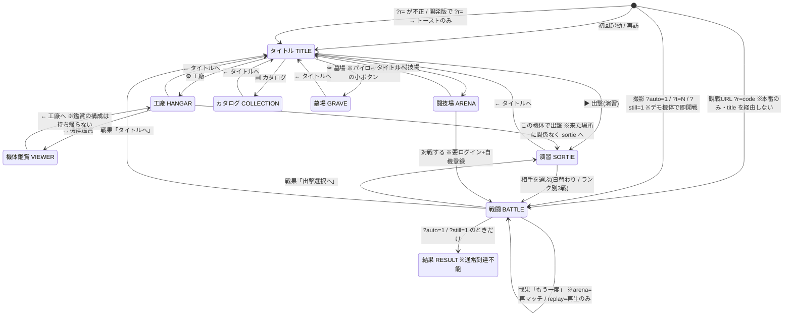
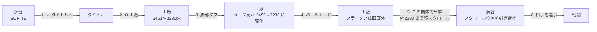
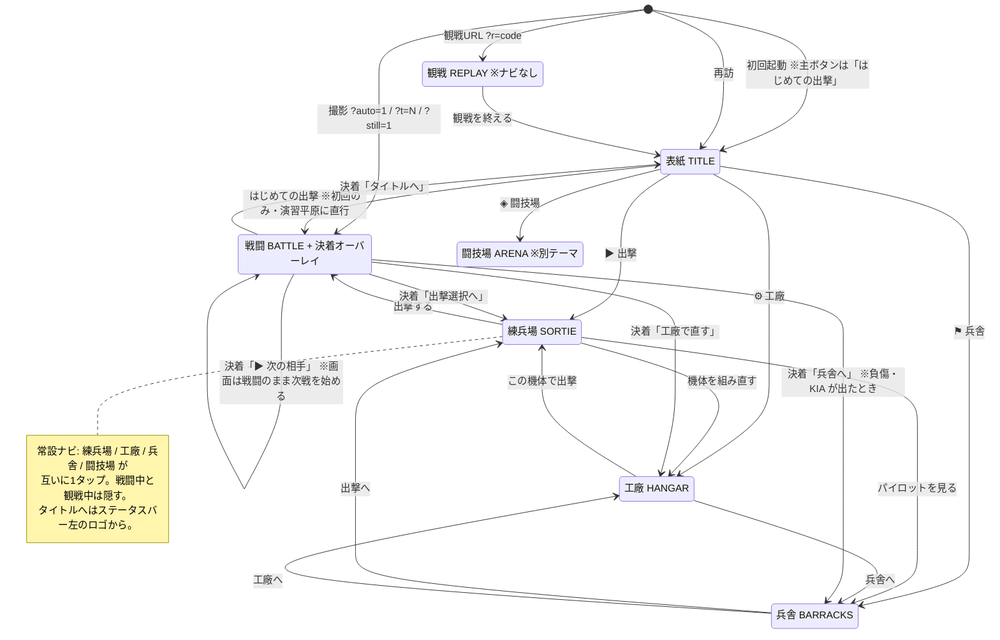
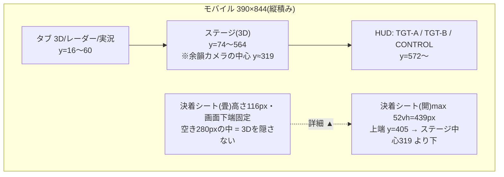
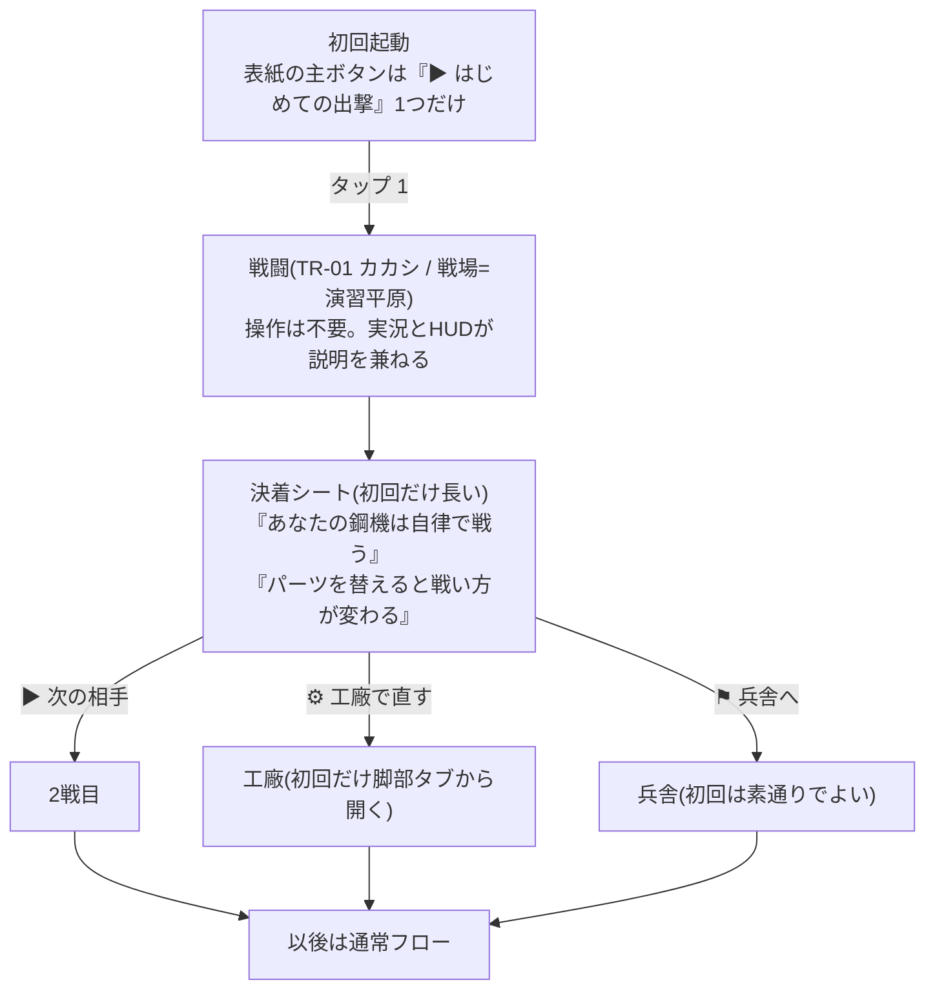

# 対戦までの画面と遷移の再構成 — 設計提案

**状態: 設計 + 段1・段2 を `public/dev` に実装済み(人間レビュー待ち)。段3〜段6 は未着手。**
2026-08-02 作成 / 同日 §4 以降を統合版に改訂・段1/段2 を実装。

> **改訂 2026-08-02**: 人間の整理と判断を取り込み、④以降を差し替えた。決定事項 =
> **決着はオーバーレイのまま**(モバイルの収め方は §4.3 に実測付きで仕様化)/ **工廠=鑑賞モード・実ビルド直編集で
> コピー廃止**(§4.4)/ **兵舎を新設(作る・選ぶ・解雇・墓場のみ。鍛える/引退は後日)**(§4.6)/
> **練兵場で機体とパイロットまで決める** / **カタログは工廠へ吸収** /
> **闘技場(大会・管理)は別テーマへ分離**(§4.8)。①②③(現状マップ・実測・問題)は初版のまま。

対象は `public/dev/`(ui.js / game.js / style.css のプレゼン層)。**シム(sim.js / fields.js / parts.js)には触れない
= REPLAY_V 据置**。本文の実測値はすべて **2026-08-02 に `public/dev/` を実機で触って採った数値**で、
推測は「仮説」と明記した。

- 単一の源は `docs/tasks.md`。本書はそこから参照される設計提案で、タスク追跡は行わない。
  `docs/tasks.md` の未完了項目「オンボーディング(初見導線)の作り込み」は本書 §4.7 / §5 段6 に畳んだ。
- 前提として守るもの(CLAUDE.md): **公開面にユーザーの自由入力を出さない(機体名は本人のみ)**・
  **出自ルール(MM の名称/データを使わない)**・**public/dev で作って人間承認後に本番昇格**・
  **本番 sim.js の互換を壊す変更は REPLAY_V を上げる**。本書の提案は全部プレゼン層なので REPLAY_V に触れない。

### 計測環境

リポジトリ直下で `python3 -m http.server` → Chromium(Playwright)で `/public/dev/` を開き、
`localStorage` をクリアして初回相当から操作。幅は **390×844(モバイル)/ 1024×768(中幅)/ 1440×900(ワイド)**。
1100px 以上でコックピットHUDに切り替わる。タップ数はページ上に capture-phase のクリック計数器、
画面遷移数は `section[data-screen]` の `hidden` を見る MutationObserver で採った。
§4.3(決着シート)の設計にあたっては **360×640 / 390×667 / 844×390(横持ち)/ 1024×600** を追加で採寸し、
戦果の行数が最大になるケース(昇格+負傷/KIA+勲章)も DOM に行を注入して実測した。

---

## ① 現状マップ

画面は `section[data-screen]` の出し分け1本(`ui.js` の `showScreen`)。定義は9つあるが、
**通常プレイで到達できるのは8つ**(`result` は撮影フラグ専用)。

読み取れる形:

- **すべての横移動がタイトルを経由する**(戻り導線は見出し右の「← タイトルへ」1本)。階層は浅いが、
  「出撃を選びかけて工廠に寄って戻る」は必ず3画面またぐ。
- **工廠の出口だけが例外**で、「この機体で出撃」は来た場所に関係なく `sortie` へ送る。
- 戦闘の終わりは画面遷移せず、`battle` の中に戦果パネルが出る(既存判断: 実況の余韻を切らない)。
- リプレイ観戦(`?r=`)と撮影(`?auto=1`)は **タイトルを一度も見せずに `battle` から始まる**。
  観戦を終えた人がゲームに入る導線は「タイトルへ」の1本だけ。
- ブラウザ履歴とは**完全に非連動**(`pushState`/`popstate`/`hashchange` の利用はゼロ)。
  モバイルの「戻る」はアプリを出る。`?r=` は URL に残るのでリロードすると同じリプレイがまた始まる。

---

## ② 動線の実測

### ジャーニーA — 初回起動から1戦目の開始まで

| | 390×844 | 1440×900 |
|---|---|---|
| タップ数 | **2**(▶出撃(演習) → TR-01 カカシ) | **2**(同じ) |
| 画面遷移 | **2**(title→sortie→battle) | 2 |
| スクロール | **0**(第1戦ボタンは y=372、fold=844 の内側) | 0 |
| 備考 | タイトル全高 966px。**ログインボタン(y=873)は fold 下** | 本文カラムは **520px 固定**(画面幅の 36%) |

**主線そのものは既に最短(2タップ)。** ここは壊してはいけない。問題は主線の外にある。

初回の演習画面(全高 1125px)の内訳: 日替わりカード 92px / 戦場選択 123px / Eランク 130px /
**🔒 のロック済みランク5ブロック 650px = 全体の 58%**。1勝すれば次ランクが開く設計なので、
初見に見えているものの過半が「今は押せない」情報になっている。

### ジャーニーB — 勝った直後に次の相手へ

| | 390×844 | 1024×768 | 1440×900(コックピット) |
|---|---|---|---|
| 戦果パネルの位置 | **y=858(fold=844 の外)** | y=361(fold内) | 3D上のガラスパネル x16,y342,360×216 |
| 決着時に必要なスクロール | **約 180px**(ボタンは y=1019) | 0 | 0 |
| タップ数 | 2(出撃選択へ → 次の敵) | 2 | 2 |
| 画面遷移 | 2(battle→sortie→battle) | 2 | 2 |

**モバイルでは、試合が終わっても画面上には何も現れない。** 3Dの余韻が続くだけで、
戦果・報酬・次の一手はすべて fold の下にある。ワイドと中幅では見えているので、**これはモバイル固有の欠落**。

さらに **`showScreen` はスクロール位置を触らない**ので、戦果パネル(y≈1019)を押して `sortie` へ移ると
**スクロール位置 289px を引き継いだまま**着地する(実測)。見出し「演習 — SORTIE」と「← タイトルへ」は
画面外から始まる。

### ジャーニーC — 機体をいじってから出撃(演習画面から)

実測のタップ列(390×844):

- タップ **6**・画面遷移 **4**(sortie→title→hangar→sortie→battle)。
- 工廠の全高は 390px 幅で **2453px(躯体タブ)〜3236px(脚部タブ=カード14枚)** = 2.9〜3.8画面。
  「この機体で出撃」は最下部 **y=2383**(保存スロット8枚 394px の下)。
- **パーツを選んでいる位置では、その効果が一切見えない**。カードリストの先頭を画面上端に置いた状態で
  実測: ステータスゲージ **0/7 可視**・機体総額は fold の **302px 上**・3Dプレビューも画面外。
- タブを切り替えるとページ高が 800px 近く変わるので、下に置いた保存スロットと出撃ボタンの位置も動く。

### その他の実測

- **機体鑑賞(viewer)**: 390px で全高 1689px・ボタン51個。ただし**ステージは `position: sticky`** なので、
  構成送り(◀▶)を操作する位置(y=406〜702)でもステージ 388px が全見えのまま。**この画面だけは
  「見ながら操作する」を解けている。工廠は同じ解を持っていない。**
- **パイロット不在で出撃を押す**: 演習画面はパイロットに一言も触れておらず(実測: 画面文言に「パイロット」
  「搭乗」の語がゼロ)、押した瞬間にトースト「搭乗できるパイロットがいません — タイトルで登録してください」で
  差し戻される。予算超過も同型(「予算超過で出撃できません」)。
- **闘技場(開発版)**: 画面には説明文と「ログインして参加」だけ。押すとトースト
  「通信部が読み込めていません」。**開発版で無効であることは画面のどこにも書かれていない**
  (起動直後の全体トースト「開発版(シム調整用)— 通信・リプレイは無効」だけが根拠)。
  本番でも未ログインなら説明+TOP20 の閲覧まで。
- **カタログ**: 全高 2396px(390px幅)。全パーツの一覧+コスメ+「準備中」の支援パス。
- **result 画面**: `showResultNow()` は `?auto=1` / `?still=1` のときしか呼ばれない = **通常プレイでは到達不能**。

---

## ③ 問題の言語化

証拠は上の実測(②)と、コードを読んで確定した事実に限る。確定していないものは「仮説」と書いた。

### P1. 決着がモバイルの画面外に落ちる ★最優先

390×844 で戦果パネルの上端が **y=858 対 fold=844**(②B)。試合が終わったのに画面には何も出ず、
自分でスクロールして初めて勝敗・報酬・次の一手を知る。ワイド(1440)は 0スクロール、中幅(1024)も fold 内なので
**モバイルだけが取り残されている**。「戦果で画面遷移しない」という既存判断(実況の余韻を切らない)は
正しいが、その実装が **右カラムへの縦積み**なので、モバイルでは「余韻の下」ではなく「画面の外」になった。

### P2. 「選ぶ」と「効果を見る」が同時に成立しない(工廠)

②C の実測どおり、パーツカードを見る位置ではステータス7ゲージも総額も 3Dプレビューも画面外。
工廠は「数字を見ながら組む」画面なのに、**組む操作と数字が 300〜700px 離れている**。
しかも同じリポジトリの中に、**同じ問題を sticky ステージで既に解いた画面(機体鑑賞)がある**。
解が repo 内にあるのに片方だけ適用されている状態。

### P3. 横移動ができない(戻り先が「タイトル」しかない)

戻り導線が「← タイトルへ」1本なので、演習↔工廠の往復が毎回タイトルを踏む(②C: 6タップ/4遷移)。
階層を浅くした設計判断の副作用で、**浅いぶん横がつながっていない**。

### P4. 戻ったときに文脈が失われる

- `showScreen` がスクロールを触らないため、遷移先が前画面のスクロール位置で始まる(実測 289px)。
- 工廠の「この機体で出撃」は、**どこから工廠に来たかに関係なく** `sortie` へ送る。闘技場に登録するつもりで
  工廠に来た人も演習画面に出る。
- 戦果の「出撃選択へ」も同様に `sortie` 固定(arena/replay は例外)。

### P5. パイロットと機体の関係が画面をまたぐ

パイロットはタイトル(人事)、機体は工廠(装備)、出撃は演習画面。**演習画面には両方の情報がない**ので、
出撃できない条件(パイロット不在・負傷・予算超過)は**押した後にトーストで**知らされる(②その他)。
「押す前に分かる」に直せる情報を、「押した後に叱る」形で運用している。

### P6. 闘技場は前提が読めない

ログイン・自機登録・レートという3段の前提があるのに、タイトルのメニューでは演習と同格の1行。
開発版では実質デッドエンド(「通信部が読み込めていません」という内部語のトースト)。
**仮説**: 本番でも「ログインして参加」を押す前に何が起きるか(Google 認証に飛ぶ・機体が識別コードで登録される)が
読めないため、離脱が起きている可能性。これはアクセス解析を見ていないので数値の裏付けはない。

### P7. カタログと墓場の位置づけが薄い

- カタログは**買えない図鑑**(パーツの購入という概念がない=総額が予算内なら使える)。
  実際 `onBuy` フックは `game.js` に定義されているが **`ui.js` から一度も呼ばれていない**(死にコード)。
  価格が「所持金と比べた色分け」として出るだけで、この画面から何かが起きることはない。
- 墓場はタイトルのパイロット枠の中の小ボタンからのみ到達。KIA は演出として重い出来事なのに、
  入口の重さが釣り合っていない。

### P8. 同じ仕事を2つの画面が別ルールでやっている(工廠 / 機体鑑賞)

「構成を替えて見比べる」は工廠の本題そのものなのに、鑑賞画面にも同じ機能がある。しかも
**ルールが逆**(工廠=保存する / 鑑賞=捨てる)。この分離には理由がある——過去に「鑑賞の構成送りが
出撃機体を書き換える」事故があり、その対策としてコピーに分離した(tasks.md 2026-07-28/29)。
つまり**分離は事故対策の結果であって、UX上の設計意図ではない**。同様に、機体の見た目を見る場所も
2つ(工廠プレビュー / 鑑賞)、パーツの情報を見る場所も2つ(工廠のカード / カタログの図鑑)ある。

### P9. 増築の化石が残っている

- `result` 画面 = 通常到達不能(撮影専用)。9画面中1つが常時デッド。
- `onBuy` フック = 呼ばれない。
- `skipBtn: null` / `resultBtn: null` / `ammoA`・`ammoB`(DOM未装着の非表示ダミー)=
  廃止済み UI の受け皿がインターフェースに残っている。
- タイトルの「← 一覧へ」(`href="../"`)は fable-playground 時代の親一覧を指す。本リポは独立リポなので、
  **仮説**: 現在の公開URLでは 404 か意図しない場所に着く(GitHub Pages のルートに何を置いているか未確認)。

### P10. ワイドで本文が 520px 固定

1440×900 で `title`/`sortie`/`hangar`/`arena`/`collection`/`grave` は **520px 幅の1カラム**(`.screen { max-width: 520px }`)。
`wide` クラスを持つのは `viewer`(960px)と `battle` だけ。結果、**コックピットHUDは全画面なのに、そこへ至る
すべての画面がスマホ幅のまま**という段差ができている。工廠は 1440px 環境でも 2942px の縦スクロール。

### P11. 初見に何も教えていない

オンボーディングは存在しない。タイトルの説明文2行だけ。**ただしこれは必ずしも欠陥ではない**:
このゲームは実況セリフが657本あり、戦闘そのものが説明になる作りをしている。問題は
「1戦目を早く始めさせる導線」と「1戦目の後に次に何をすればいいか」が無いこと(§4.7)。
なお `plain`(演習平原)は **どのランクの戦場にも割り当てられておらず、日替わりのランダム候補からも
除外されている** ので、「演習平原」という名前の戦場は明示選択しない限り一度も出てこない。

---

## ④ 改善案(統合版)

**2026-08-02 に人間が出した整理を取り込んだ版。** 初版(案1/案2/案3 の比較)からの主な変更は
**⑴兵舎の新設 ⑵練兵場で機体とパイロットまで決める ⑶カタログを工廠へ吸収 ⑷闘技場を別テーマへ分離**。
経緯は §4.10。**決着はオーバーレイのまま(人間判断 2026-08-02)** で、置き方だけ直す(§4.3)。

### 4.0 設計の芯

1. **主線の段数は増やさない。** タイトル→練兵場→戦闘 の2タップ(実測)は資産。ブリーフィングは新しい段ではなく練兵場の中身。
2. **戻るのではなく横へ動く。** 工廠・兵舎・練兵場・決着 は互いに1タップ。
3. **見ながら操作する。** 鑑賞画面が既に持っている sticky ステージの解を工廠へ。
4. **決着は必ず視界に入れ、かつ余韻を隠さない。** 両立させる(§4.3)。
5. **押す前に分かる。** トーストで差し戻していた条件(パイロット・予算)を練兵場に出す。
6. **1画面1役。** 棚(記録/その他)ではなく意味(人/機体/出撃)で分ける。

### 4.1 画面と機能

| 画面 | 役割(1つだけ) | 機能 | 現状からの変化 |
|---|---|---|---|
| **タイトル** | 表紙 | メニュー・ログイン・お知らせ | パイロット3枠・墓場・クレジットを外へ出す(実測 966px → fold 内に収まる) |
| **兵舎 BARRACKS**(新設) | 人 | **今回作るのは 作る/選ぶ/解雇/墓場 だけ**(鍛える・引退は後日) | タイトル内の人事機能 + `grave` 画面を統合。**器を先に作る**(§4.6) |
| **工廠 HANGAR = 鑑賞モード** | 機体 | **全画面ステージで動かしながらパーツを選ぶ(実ビルド直編集)**・カラー/機体名・保存スロット・コスメ | `viewer` と `collection` を吸収。**コピーを廃止**(§4.4) |
| **練兵場 SORTIE**(旧・演習) | 出撃の決定 | 戦場・対戦相手・**機体(保存スロット)・パイロット**を選ぶ | 機体とパイロットの選択がここに来る |
| **戦闘 BATTLE** | 観戦 | 3D・レーダー・実況(≥1100px はコックピットHUD) | 変更なし。**ナビは出さない** |
| **決着**(battle 内のオーバーレイ) | 結果 | 戦果・報酬・人事・次の一手 | 画面遷移しない現状を維持し、**置き方だけ**直す(§4.3) |
| **闘技場 ARENA** | 対人 | 別テーマ(§4.8) | 今回の再構成の対象外 |
| (`result`) | 撮影専用 | `?auto=1` / `?still=1` のみ | 残置(要確認③) |

**カタログを工廠へ吸収する根拠**: 実測 2396px の中身は、工廠のパーツカードの読み取り専用の複製+コスメ+
「準備中」の支援パス。パーツは購入する概念がない(総額が予算内なら使える)ため、
`onBuy` フックは `ui.js` から一度も呼ばれていない死にコード。コスメ(勲章で買う)だけ工廠のカラー行の隣へ移せば画面ごと畳める。

**画面数**: 現状9(うち1つ到達不能)→ **6 + 闘技場(別テーマ)+ 撮影用 result**。

### 4.2 遷移図

### 4.3 決着オーバーレイの仕様(核心)

**結論: 画面遷移はしない。モバイルは「画面下端に固定する2段のシート」にして、3Dの余韻を隠さずに必ず視界へ入れる。**

#### どこが破綻しているか(実測 2026-08-02)

| レイアウト | 例 | 戦果の位置 | fold からの溢れ |
|---|---|---|---|
| 縦積み(<720px) | 390×844 | y=858〜1068 | **224px 溢れ**(最悪=KIA行入りで 306px) |
| 縦積み | 390×667 | y=756〜965 | **298px 溢れ** |
| 縦積み | 360×640 | y=740〜950 | **310px 溢れ** |
| 横並び(≥720px) | 844×390(横持ち) | y=328〜519 | **129px 溢れ** |
| 横並び | 1024×600 | y=361〜570 | 通常は収まる(−30px)が **最悪 KIA で 53px 溢れ** |
| 横並び | 1024×768 | y=361〜570 | 収まる |
| コックピット(≥1100px) | 1440×900 | x16,y342,360×216 | 収まる(3Dの上の左中段パネル) |

戦果ボックスの高さは **210px(通常)〜292px(昇格+負傷/KIA+勲章で5行増えた最悪ケース。1行16px)**。

→ **破綻するのは「縦積みのとき」と「横並びでも高さが足りないとき」。**
境界の目安は **幅 720px 未満、または高さ 660px 未満**(最悪ケース 292px で計算した値。実装時に再実測して確定する)。

#### 仕様

**⑴ 畳んだ帯(決着した瞬間の既定)** — 画面下端に固定・高さ **116px**(実装後の実測)。

- 中身: 勝敗見出し(既存の色分類 win/lose/draw/surrender をそのまま使う)+「時間 ・ +報酬 C」+
  主ボタン「**▶ 次の相手 — TR-02 マト**」+「詳細 ▲」。
- **3D を 1px も隠さない。** 実測のステージ下端〜fold の空き: 390×844=**280px** / 390×667=**206px** / 360×640=**195px**。
  116px の帯はどの機種でも余白の中に収まる。
- 隠れるのは HUD(TGT-A/B・CONTROL)の一部だけ。試合は終わっているので HP ゲージの優先度は落ちている。

**⑵ 開いた状態(「詳細」または上スワイプ)** — `max-height: min(52vh, 440px)` + 内部スクロール。

- 中身: statLines 全部(戦場・残存HP・人事・減衰・勲章)+ 全ボタン(§4.5)。
- **52vh を上限にする理由は、ワイドで戦果パネルを中央に置かなかったのとまったく同じ**:
  余韻カメラは敗者を画面中心に据えるので、そこを塞いではいけない(2026-08-01 の判断)。
  実測のステージ中心は 390×844 で y≈319、360×640 で y≈259。上限 52vh ならシート上端は **405 / 307** で、
  どちらも中心より下に留まる。
- 最悪ケース 292px は 52vh(390×844 で 439px / 360×640 で 333px)に収まるので、
  通常は内部スクロールが出ない。スクロールは保険。

**⑶ 共通**

- 下端の安全域は既存の `--safe-b` を使う(コックピットのレーダーPiP と同じ扱い)。
- 開閉状態は試合をまたいで保持しない(毎回「畳んだ帯」から)。
- ワイド(≥1100px)は**現状のまま**。左中段・幅360px・高さ820px以下はレーダー上端を基準に積む、という
  2026-08-01 の作り込みは動かさない。
- 実況ログタブ表示中も帯はステージの下にあるので、ログを隠さない。

### 4.4 工廠 = 鑑賞モード(人間判断 2026-08-02)

**結論: 工廠と機体鑑賞を1つにする。全画面のステージで機体を動かしながらパーツを選び、書き換えるのは
実ビルド(`S.current`)そのもの。コピーを作らない。** これで③ P2(選ぶと見るが同時に成立しない)と
③ P8(同じ仕事を2画面が別ルール)が同時に消える。

#### なぜコピー問題が「消える」のか

鑑賞用ビルドをコピーに分離したのは、**「鑑賞の構成送りが出撃機体を黙って書き換え、予算超過で出撃不能になった」**
事故(2026-07-28)の対策だった。事故の芯は *書き換わったこと* ではなく **「別の場所で編集した結果が、
見えないところで本体に入った」** こと。統合すると:

- **編集する場所と結果が出る場所が同じ**になる(全画面ステージの上に総額/予算ゲージが常に載っている)。
- **予算超過は固定バーで常時赤表示**にし、**超過中は「この機体で出撃」を無効化**する
  (判定は現在の `onEquip` と同じ `buildCost(build) > S.credits`)。
- 超過は**データの損失ではなく可逆な状態**。事故のときに悪かったのは「気づけなかったこと」だけ。

したがって分離は不要になる。**むしろ統合は削除で実現できる** — 消えるものが増えるだけ:

| 消えるもの | 現在の役割 |
|---|---|
| `viewerBuild` / `viewerStats` / `viewerDerive`(ui.js) | 鑑賞用コピーの保持と再計算 |
| `ui.viewerBuild()`(ui.js の公開面) | game.js が描画対象を取る口 |
| `onDeriveStats` フック(game.js) | コピーの表示専用ステータス計算のために足したもの |
| `viewerOpenBtn` のコピー生成(`JSON.parse(JSON.stringify(hb))`) | 開くたびに工廠の現構成から作り直す処理 |
| `viewer` 画面まるごと(`data-screen="viewer"`) | 独立画面 |

`game.js:495` は既に `(ui.viewerBuild && ui.viewerBuild()) || S.current` というフォールバックを持っているので、
**`ui.viewerBuild` が無くなれば自動的に `S.current` を描く**。パーツ選択は既に
`onPartChange` が `S.current = build; save()` を毎タップ実行している = **工廠側は元から実ビルド直編集**で、
今回そろえるのは鑑賞側だけ。

**副産物**: WebGL レンダラのインスタンスが **3個(工廠プレビュー / 鑑賞 / 戦闘)→ 2個**になる。
tasks.md に申し送られている「レンダラ3インスタンスごとに地面512²と PMREM が重複生成(初回フレーム 73〜107ms)」の
うち1組がそのまま消える。

#### 画面の作り

**全画面ステージ + 計器オーバーレイ**。これは**戦闘のコックピットHUD(≥1100px)と同じ文法**で、
「準備の画面はスマホ幅の1カラム、戦闘だけ全画面」という現在の段差(③ P10)も同時に埋まる。

| | モバイル(<720px) | 中幅〜ワイド(≥720px) |
|---|---|---|
| ステージ | 上部に sticky(鑑賞の現行 `min(46vh, 460px)` を踏襲。実測 390×844 で 388px) | 画面を占める。操作パネルは右に 330〜380px(鑑賞の現行 row レイアウトを踏襲) |
| 常時見えるもの | ステージ直下の細い帯: **総額/予算・主要ステータス・総合評価** | ステージ下端または右カラム上部に同じ帯 |
| 操作 | 帯の下をタブで切替: **「組む」**(パーツ/カラー/機体名)と **「動かす」**(移動/歩調/旋回/動作/カメラ/構成送り) | 右カラムに同じ2タブ |
| 保存スロット | 下の帯の「💾 スロット」から呼び出す(下記の判断) | 同じ |
| 出撃 | 下端固定バーの「この機体で出撃」(超過中は無効) | 同じ |

- **数値がステージに隣接する**ので、③ P2 の実測(パーツを選ぶ位置でステータス **0/7 可視**・総額は fold の
  302px 上)が構造的に起きなくなる。
- パーツの選び方は**カード一覧(現・工廠)と ◀▶ 送り(現・鑑賞)の両方を残す**。前者は比較して選ぶため、
  後者は動かしながら見比べるため。書き込み先が同じになるので、二重管理にはならない。
- 現在の鑑賞の51個のボタンは「動かす」タブに入る。ステージのドラッグ回転/ホイールズームもそのまま。

#### 保存スロットの置き場所(設計者判断 2026-08-02。人間から一任)

**「組む」タブの中に常設しない。固定バーの「💾 スロット」から呼び出す小さな面(シート)にする。** 理由:

- 実測で保存スロット8枚は **394px**(390px幅)あり、常設するとパーツ選びの縦距離をそのぶん押し下げる
  = P2 を自分で作り直すことになる。
- 触る頻度が低い(1機を作り込む間に何度も開かない)。パーツ・カラーとは操作のリズムが違う。
- 練兵場が「スロットから機体を選ぶ」設計(§4.6)になるので、工廠側の保存は**単発の書き出し操作**として
  独立させたほうが役割が澄む。シートの中で「読込 / 保存」を両方出す。

#### 気をつける点

- **予算超過のまま工廠を出るときは一度止める**(人間判断 2026-08-02)。出撃ボタンの無効化だけでは
  離脱経路(「← タイトルへ」)が塞がらず、超過構成が出撃機体として確定してしまう
  = 次に演習を押すとトーストで差し戻される、2026-07-28 の事故と同じ入口。戻せる状態なので禁止はせず、
  **気づかずに出ることだけ**を防ぐ(総額と予算を出した確認ダイアログ)。予算内なら何も出さない。
- **保存スロットの意味を変えない。** 直編集で書き換わるのは `S.current` だけで、`S.slots[8]` は
  「保存」を押したときだけ。練兵場はスロットから選ぶ(§4.6)ので、**「試して気に入ったら保存」**という
  今の流れがそのまま安全網になる。
- 「撃破(崩れ落ちる)」を実演したまま工廠を離れても、**次に入ったときは直立・停止から始める**。
  現行は `viewerOpenBtn` が開くたびに `move='stop'` / `turn=0` / `rise` を積んでいるので、
  **その処理の置き場所を「鑑賞を開くとき」から「工廠に入るとき」へ移す**(消さない)。
- 予算超過のまま出撃しようとしたときの既存トーストは**保険として残す**(押せないのが第一。トーストは第二)。

### 4.5 決着 → 次の一戦

ボタンの並び(現状: シェア / リプレイURL / 出撃選択へ / タイトルへ):

| 順 | 統合版 | 置き場所 | 備考 |
|---|---|---|---|
| 1 | **▶ 次の相手 — TR-02 マト** | 畳んだ帯 | 勝った直後の最短。**クリア済みは対象外**なので報酬減衰の抜け道にならない |
| 2 | ⚑ 兵舎へ | 開いた状態 | **段3 で追加予定**(負傷・KIA が出た試合でだけ出す) |
| 3 | シェア / リプレイURL / ⚙ 工廠で直す / 出撃選択へ / タイトルへ | 開いた状態 | **段1 の実装順はこの並び**(`ui.js` の `detailBtns`)。畳んだ帯に主ボタンが出るので、開いた側の順序は現状のまま据え置いた |

**行き先**: `nextUnclearedFight(fromRank)` = **いま戦ったランクから先に**探した、解放済みランクの最初の未クリア戦。
ランク解放は「直前ランクをどれか1戦クリア」なので、下位に未クリアを残したまま上へ行けるのが正規の遊び方
——**先頭から探すと上位ランクで勝った直後に最下位ランクへ引き戻される**(レビューで発覚。実測: D第1戦に
勝った直後の主ボタンが「▶ 次の相手 — TR-02 マト」=報酬160に勝って報酬100のE戦へ)。同ランクを先に見ることで、
勝てば同ランクの次へ進み、**負ければ同じ相手が対象になり「▶ 挑み直す — 名前」**になる。

**既存判断との関係**: `onRetry` が「もう一度」ではなく「出撃選択へ」なのは**同構成連戦を誘導しないため**。
報酬減衰(`S.history` に構成ハッシュ5件、同じ敵×同じ構成で 1→0.5→0.25→0.1)は**勝った敵ごと**に効く。
「次の相手」も「挑み直す」も**クリア済みの戦は決して対象にしない**ので、減衰が抑えている
「勝った敵に勝ち続けて稼ぐ」導線にはならない。したがってこの方針は
**「勝った相手にもう一度は出さない」** と読む(負けた相手への再挑戦は報酬0なので対象外。人間判断 2026-08-02)。

### 4.6 パイロットと機体 — 兵舎と練兵場の分担

**兵舎=人を育てる場所 / 練兵場=今日誰が何に乗るかを決める場所。**

- **兵舎(今回作る範囲)**: パイロットを**作る・選ぶ・解雇する**、そして**墓場**。
  = いまタイトルにある3枠のロースターと `grave` 画面を、そのまま器ごと引っ越すだけ。
  **新しいゲーム機能は足さない**(人間判断 2026-08-02「鍛える・引退は後で作る。兵舎だけ実装する」)。
  これによりタイトルから 308px(パイロットパネル)が外れ、実測 966px の表紙が fold 内に収まる。
- **後日ぶん(器だけ用意しておく)**: 「鍛える」「引退」。
  土台は既にある — Lv は `xp/120`(上限 Lv8)、名誉・負傷・KIA も実装済み。
  **引退は既存の「解雇」の対として設計できる**: 現在の解雇は確認文で「記録は残りません」と明言しているので、
  引退=記録を残して降りる(墓場ではない場所に残る)とすれば、解雇がそのまま「不名誉な別れ」として意味を持つ。
  ただし今回は**解雇を現状のまま残す**(引退が無いうちに解雇の意味を変えない)。
- 練兵場: 戦場・相手・**機体(保存スロット8枚から)**・**パイロット(3人から)** を選んで出撃。
  これで実測した「押した後にトーストで差し戻される」(パイロット不在・予算超過)が消える。
  `onFight` 側の既存ガードは保険として残す。

**データ面の含意(重要)**: 現状 `S.current` は工廠の編集バッファ兼・出撃機体、`S.slots[8]` が保存。
練兵場での選択は「**スロットを選ぶ = `current` を差し替える**」で表現できるので、**`S` へのキー追加すら不要**。
ただし「予算超過のスロットは選べない」表示が要る(`onEquip` の総額>所持金チェックと同じ判定)。
**工廠=1機を作り込む(編集)/練兵場=保存済みから選ぶ(選択)** と役割を割り切ることが条件で、
これを曖昧にすると「同じ仕事を2画面が別ルールでやる」(③ P8)が再発する。

### 4.7 初見導線(オンボーディング)

**方針: 読ませない。1戦目を先に体験させ、説明は決着に置く。** 実況セリフ657本が既に解説役をしている。

- 初回だけ**戦場を `plain`(演習平原)に固定**する。現状 `plain` はどのランクにも割り当てがなく
  日替わりのランダム候補からも除外されているので(③ P11)、**「演習平原」という名前が初めて意味を持つ**。
  遮蔽なしの正面決戦=何が起きているか一番読みやすい戦場でもある。
- 初回フラグは `S` への**キー追加のみ**(§5 の非破壊条件)。
- 2戦目以降は表紙の主ボタンが「▶ 出撃」に戻る。**チュートリアルのモーダルもツアーも作らない。**

### 4.8 闘技場は別テーマとして切り出す

人間の整理にあった「闘技場へ行く/闘技場から戻る/闘技場を作る(管理者用)」は、
**UI 再構成ではなく新機能(サーバ設計)**なので、本テーマからは外す。理由:

- **現状の闘技場は同期**。`POST /arena/fight` を叩くとサーバがその場でシムを回して勝敗を返し、すぐ観戦できる。
  「大会に出して、後で結果を見に戻る」は**非同期**で、開催期間・組み合わせ・順位表・レギュレーションの
  保管が要る = `workers/kouki`(D1+KV)の新規設計。画面整理と同じ単位で扱うと、どちらも終わらない。
- **⚠ CGM回避設計の最大の危険がここにある。** パイロット名は12文字の自由入力で、**現在は端末の外に一切出ていない**
  (闘技場の登録は `stripName` で機体名を落とし、リプレイに載るのは補正値の数字だけ)。
  大会の順位表は本質的に「他人に見せる表」なので、**出せるのはサーバ発行の識別コードだけ**。
  この線を最初に引かないと、気づいたときには公開済みになる。
- **「闘技場を作る」を公開クライアントに置かない。** 管理UIをクライアントに置くと、レギュレーションの判定は
  必ず迂回されうる(サーバ権威が要る)。CLAUDE.md の「サーバ権威はレーティングのみ/秘密はクライアントに
  露出しない」とも整合しないので、別URL か wrangler/D1 側の運用にする。

**本テーマで闘技場に対してやること**は、現状画面の手当てだけに絞る:

- 未ログインでも「ランキング TOP20」を主役に置き、参加条件を3ステップで明示(①ログイン ②自機を登録して
  識別コードを受け取る ③対戦する)。
- **開発版では画面の中に「開発版では通信が無効です」と出す**(現状はトースト「通信部が読み込めていません」だけ=内部語の袋小路)。
- **闘技場の中にもログインを置く**(現状もそうなっている)。タイトルだけに置くと差し戻しの導線が残る。
- タイトルのメニューでは**闘技場は1項目**にする(「行く/戻る」は中のタブ)。
  実測でタイトルは 966px・ログインが fold 下に落ちているので、項目を増やすと悪化する。

### 4.9 CGM回避設計・出自ルールの点検

- ブリーフィング(練兵場)と決着シートに出す機体名・パイロット名は**本人の画面のみ**。
  闘技場のランキング/履歴は現状どおり**サーバ発行の識別コードだけ**。`shareData` に機体名を入れない現状を維持。
- リプレイURLに自由入力を載せない現状の設計(演習/日替わりは静的データから復元、それ以外はコードから
  識別コード風に生成)に触れない。
- 将来の大会機能でも**順位表に出せるのは識別コードだけ**(§4.8)。
- 追加する画面名・ラベルはすべて一般語(工廠/兵舎/練兵場/闘技場/決着)。MM 由来の名称・データは使わない。

### 4.10 検討の経緯(記録)

初版では次の3案を比較し、案2を推した。最終案は**案2の骨格に、人間の整理(兵舎の独立・練兵場での一括選択・
闘技場の分離)を取り込んだもの**で、案2より画面の役割分担が明確になっている。

| | 案1 最小手当て | 案2 常設ナビ+3面 | 案3 工廠ハブ |
|---|---|---|---|
| 骨格 | 9画面のままレイアウトだけ直す | 6画面へ整理+常設ナビ | タイトルを廃し工廠をハブに |
| 機体をいじって出撃 | 6タップ/4遷移(現状のまま) | 4タップ/2遷移 | 4タップ/2遷移 |
| 実装コスト | 小 | 中 | 大 |
| 既存思想との整合 | ◎ 何も壊さない | ○ | △ 作品の表紙を失う |

案3を採らなかったのは、この作品が展示物でもあり、タイトルが「いにしえの自律対戦シミュレータへのオマージュ」という
作品説明を担っているため。1段減らす価値より表紙を失う損が大きいと判断した。
**案1は最終案の部分集合**なので、そのまま第1段として使える(§5 段1)。

---

## ⑤ 移行の段取り

### 段0(前提)— **一連の UI/UX 改修が終わるまで本番は触らない**(人間判断 2026-08-02)

**すべて `public/dev` だけで進め、`public/` へは一切コピーしない。** v5(St4+小障害物+観戦カメラ)の昇格も
UI/UX 改修の完了後に、**まとめて1回**行う。初版で推していた「v5 を先に昇格させてから UI」は撤回。

この決定から出てくる約束事:

- ⚠ **`make-dev.mjs` を絶対に流さない。** 本番から dev を再生成するので、
  **v5 一式(tex.js を含む)も UI/UX 改修も丸ごと消える**(git からは戻せるが作業は飛ぶ)。
  CLAUDE.md の警告が、いまは St4 だけでなく本改修にも掛かっている。
- 本番 `public/` は**当面 v4 のまま**。dev だけが先へ進む二重状態が長く続くので、
  dev で見つけた不具合を「本番でも起きる」と早合点しない(描画・UI とも別物になっていく)。
- **最終的な昇格は1回にまとめる**: 描画側(v5)+ UI 一式 + `release-sim.mjs`(REPLAY_V 4→5)+
  `replay.js` の FIELD_CODES 追記 + dev の replay.js 同期 + worker 再デプロイ。
  手順の正本は `docs/tasks.md` の St4「昇格手順」で、**コピー対象に `ui.js` / `style.css` が加わる**点だけ
  本改修の完了時に追記する。
- リリース差分に「描画の回帰」と「UI の回帰」が同居するので、**段ごとの人間レビューを dev で済ませておく**ことが
  唯一の切り分け手段になる(1段=1画面を守る理由がさらに強くなった)。

**1段=1画面**を原則にする(混ぜると人間レビューの単位が大きくなり、回帰の切り分けができなくなる)。

### 段1 — 非破壊のレイアウト手当て 〔**public/dev に実装済み 2026-08-02・人間レビュー待ち**〕

`S` にも URL にも触らない。REPLAY_V 据置。**画面の骨格は変えない、いちばん小さい段。**

1. ✅ **決着シート**(§4.3)。縦積みと低背の帯だけ下端固定に切り替える。
2. ✅ **「▶ 次の相手」を主ボタンに**(§4.5)。
3. ✅ `showScreen` で遷移先を先頭にスクロールする(③ P4)。
4. ⏸ ~~ワイドの本文幅 520px 固定を緩和する(③ P10)~~ → **段5 のあとへ送った**。
   最終的な幅は画面の顔ぶれが決まってからでないと決められない(工廠は段2で全画面、練兵場は段4で
   ブリーフィング、カタログは段5で消える)。いま決めると三度やり直すことになる。

> **初版にあった「工廠のプレビューを sticky に + 下端固定バー」もこの段から外した。**
> 段2で工廠を全画面ステージに作り直すので、先に sticky を入れると捨てる作業になる(§4.4)。

**実装の要点**(`ui.js` / `style.css` / `game.js`。シムは非改変):

- `showAftermath` の中身を **bar(常に見える)/ detail(たたむ)** の2段に分けた。
  折り畳みは CSS 側だけで効かせるので、広い画面の見え方は変わらない。
- 決着シートの CSS は `@media (max-width: 719px), (max-height: 660px)` で入る。
  **横並び(≥720px)で低い窓のときは全幅ではなく HUD の列(300px)にぴったり重ねる** —
  全幅にすると 3D の下端を食い、開くと敗者まで隠すため(実測 844×390: 全幅ではシート上端 274 に対し
  ステージ下端 324、開くと 187 で画面中心 199 を割る)。
- `startCampaignFight(rank, idx, fieldChoice)` を新設し、**出撃画面からも決着の「▶ 次の相手」からも
  同じ入口**を通す(条件・戦場の決め方・ctx の形が1箇所)。戦場は直前の選択(`ctx.fieldChoice`)を引き継ぐ。
- 「▶ 次の相手」の行き先は `nextUnclearedFight()` = **解放済みランクの最初の未クリア戦**。
  勝てば前へ進み、負ければ同じ相手に挑み直す(ラベルだけ「▶ 挑み直す — 名前」に変わる)。
  **クリア済みは決して対象にならない**ので、報酬減衰が抑えている「同じ敵に勝ち続ける」導線にはならない。
  KIA で搭乗員が居なくなった直後は出さない(押してもトーストで差し戻すだけの空ボタンになるため)。
- 決着から `⚙ 工廠で直す` を追加(リプレイ観戦を除く)。
- `startBattle` の頭で読み上げを止める(「▶ 次の相手」は `stopBattle` を通らないため)。

**この段で直したコックピット側の回帰**(自分の変更が作ったもの):
戦果パネルに主ボタンの行と「工廠で直す」が増えたぶんパネルが高くなり、**最悪ケース(昇格+KIA+引き継ぎ+勲章)で
1440×860 のときレーダーPiPに 18px 食い込んだ**(2026-08-01 に決めた 820px の境界は最大 300px 級のパネルを
前提にしていた)。固定値の見積もりをやめ、**上限を幾何から出す**形にした
(中段配置は上下対称に伸びるので `100dvh − 2×(下端の障害物)`、低い窓の積み直し配置は
`100dvh − 下端の障害物 − TGT-A のぶん 215px`)。溢れたぶんは中でスクロールする。
副産物として、申し送りに残っていた「高さ640px前後で戦果パネルが TGT-A と24px重なる」も解消した。

**検証(実測 2026-08-02)**: 決着シートが 3D を隠さないこと・スクロールなしで視界に入ることを
360×640 / 390×844 / 844×390 / 1024×600 / 1024×768 / 1120×640 / 1280×720 / 1440×860 / 1440×900 で確認。
コックピット帯は最悪ケースの行数を注入して**レーダー・TGT-A との余白がどの窓でも 12px 以上**であることを確認。
主ボタンは最長の敵機名「GH-43 フクロウノメ」でも 360px 幅で収まる(実測 185px / 内寸 249px。念のため ellipsis も付けた)。
`?auto=1` の撮影経路(result 画面)も従来どおり。console エラー 0。
harness(dev) ALL GREEN / cam-probe(dev) ALL GREEN / gait-harness(dev) ALL GREEN / check-freeze OK(v4==live)。

### 段2 — 工廠 = 鑑賞モード(§4.4) 〔**public/dev に実装済み 2026-08-02・人間レビュー待ち**〕

- ✅ ステージ+計器の1画面に作り直し、`viewer` 画面を畳んだ(画面は 9 → 8)。
- ✅ **鑑賞用コピーを廃止し、実ビルド直編集に**。作業の主体は**削除**だった:
  `viewerBuild` / `viewerStats` / `viewerDerive` / `ui.viewerBuild()` / `onDeriveStats` フック /
  コピー生成 / `previewTick` と工廠プレビュー用レンダラ一式。
- ✅ 総額/予算を下の帯に常時表示し、**超過中は「この機体で出撃」を無効化**(実測: 総額18,000/3,260Cで
  ボタンが `disabled`・ラベルが「予算超過 — 出撃できません」)。
- ✅ **WebGL レンダラのインスタンスが 3 → 2**(`makeR3D` の呼び出しが工廠ステージと戦闘だけになった)。
  tasks.md の申し送り「3インスタンスで地面512²と PMREM が重複生成」の1組がそのまま消えた。

**実装の要点**:

- ステージの canvas は `class="mech-viewer"` のまま = `game.js` の駆動側(`viewerTick`)がそのまま使える。
  `viewerTick` の描画対象を `ui.viewerBuild() || S.current` から **`S.current` 一本**にした。
- **自動実演を残した**: 旧・工廠プレビューの20秒の巡回(`previewMove`/`previewFx`)は捨てず、
  `viewerIn.auto` が真の間その振り付けで動く。移動/旋回/動作のボタンを触った瞬間に手動へ降りる
  (`🎬 自動実演` ボタンで戻せる)。**工廠に入ったら必ず「直立・停止・自動実演」から**始まる
  (旧・鑑賞の `viewerOpenBtn` が持っていた責務を `showScreen('hangar')` へ移した)。
- パーツは**カード一覧(組む)と ◀▶ 送り(動かす)の両方**から替えられる。書き込みは `applyPart()` 1本に集約したので
  二重管理にならない。
- **保存スロットは呼び出し式のシート**にした(§4.4 の判断)。8枚で 394px あり、常設するとパーツ選びを
  そのぶん下へ押し下げる=直したはずの P2 を自分で作り直すことになる。読込を押すとシートは閉じる。
- 画面は `.screen.wide`(960px)。**full-bleed にするかは、送った「本文幅」の決定と一緒に**(§5 段1 の ⏸)。

**検証(実測 2026-08-02)**:

- **P2 が構造的に消えた**: パーツカードの先頭を画面上端に置いた状態(旧実装が **ゲージ 0/7 可視・総額は
  fold の 302px 上**だった条件)で、390×844 で **ステージ 388px 全見え / ゲージ 6/6 可視 / 総額と出撃ボタンも可視**。
- 直編集の確認: ◀▶ で `lg1 → lg2` と送ると `localStorage` の `current.legs` が追従し、総額が 2,650→2,680C に更新。
- 保存スロット: 保存 → 別のパーツへ変更 → 読込 で元の構成に復帰(`lg14 → lg1 → lg14`)。
- 導線: 工廠 →「この機体で出撃」→ 演習 → 戦闘 → 決着 →「⚙ 工廠で直す」→ 工廠(自動実演にリセット・scrollY 0)。
- 1440×900(ワイド2カラム)/ 390×844(縦・sticky ステージ)とも実機確認。**console エラー 0**。
- harness / cam-probe / gait-harness(dev)ALL GREEN・check-freeze OK(v4==live)。

### クロスレビュー(Codex × Claude 並列)で直した7件(2026-08-02)

**重複ゼロ。Codex の1件は実測で否定した。**

1. **「次の相手」が上位ランクから最下位ランクへ引き戻していた**(Claude・**最も実害が大きい**)。
   `nextUnclearedFight()` が CAMPAIGN の先頭から探していた。同ランク優先に直した(§4.5)。
   文書化していた「負ければ挑み直す」も、直すまで**一度も出ていなかった**。
   実データ総当たりで再検証: 勝E1→E2 / 負E1→挑み直しE1 / 勝D1→D2 / 負D1→挑み直しD1 /
   **Dを全クリアした状態で**勝D3→C1 / 日替わり(fromRank なし)→先頭の未クリア / 全クリア→null。
   実機でも 勝E1→「▶ 次の相手 — TR-02 マト」・負D1→「▶ 挑み直す — KG-11 アシガル」を確認。
   (同ランク内に前の未クリア戦が残っている場合はそちらが先に返る=下記「参考」の⑸)
2. **決着の「⚙ 工廠で直す」だけ `refreshCampaign()` を呼んでいなかった**(Claude)。演習画面は
   `refreshCampaign` でしか作り直されないので、**勝ってランクが解放されたのに 🔒 のまま**が
   リロードまで残っていた(他の出口3つは全部呼んでいた)。
3. **スロットシートが総額バーと出撃ボタンを完全に覆っていた**(Claude)。兄弟で両方 `sticky; bottom:0` に
   すると下端を取り合う。実測 390×844 で重なり 92px=バー全部、当たり判定も `.slot-grid` に奪われ、
   **コピー廃止を支えている安全網そのものが無効**になっていた → シートを**バーの中**へ移した。
4. **コックピットの新しい `max-height` が低背窓で 0 に丸められ、戦果パネルが消えていた**(Claude)。
   `.cockpit` は幅条件だけなので「幅は足りるが高さが無い」窓で成立する。実測 1280×450 で
   `max-height:0` / 実高16px / `scrollHeight` 199px = **「▶ 次の相手」も押せない**。
   **§5 段1 で入れた幾何式が作った回帰** → 下限 150px を入れた(そこまで詰まったら TGT-A の予約を諦める)。
5. **予算超過のまま工廠を離れられた**(Claude → 人間判断で対処)。上記「気をつける点」。
6. くり返しボタンが自動実演中に押しても何も起きなかった(Claude)→ 押したら手動へ降りる。
7. docs の食い違い(Claude): 冒頭の状態表記が「設計のみ(実装なし)」のまま / 畳んだ帯の高さ
   96px と 116px の不一致(実測 **116px** が正)/ §4.4 の表が保存スロットを「組む」タブ内と書いていた。
- **実測で否定した指摘**(Codex): 「開いた決着シートの `overflow-y:auto` は効かず 52vh を超える」。
  `.aftermath-box` は `.tgt-box` から `display:flex; flex-direction:column` を受け継いでおり、
  `.aftermath-detail` に `min-height:0` を置いてあるので縮む。**844×390 で14行を追加注入しても
  箱は 203px(=52vh)のまま・detail が内部スクロール**(`scrollHeight` 416 / 表示 83)。
### 再レビュー(修正箇所に絞ってもう一巡)で直した6件(2026-08-02)

1. **工廠の予算が古いまま固まっていた**(Claude・**実害あり**)。`st.budget` は `renderHangar()` が呼ばれた
   時点の所持金を数値で写したものだが、**タイトルの「⚙ 工廠」は `showScreen('hangar')` を呼ぶだけで
   `refreshHangar()` を通らない**。段2以前は総額ゲージの色だけの問題だったが、
   **予算が出撃の可否を決めるようになったため実害に昇格**——所持金は増える一方なので必ず「厳しすぎる」側に
   倒れ、予算内でも「予算超過 — 出撃できません」になり、離脱確認まで誤発火していた
   (戦果の「⚙ 工廠で直す」経由だけは `refreshHangar()` を通るので正常だった=経路で挙動が変わる厄介な形)。
   → `showScreen('hangar')` に `onEnterHangar` フックを足し、**どの経路から入っても取り直す**
   (人間判断 2026-08-02)。実測: 3,000C で入場 → 1戦勝って 3,100C → タイトル経由で再入場して
   「機体総額 2,650 / **3,100** C」に追従。
2. **武装を ◀▶ で替えても動作ボタンのラベルが前の武器名のままだった**(**Codex**)。
   `applyPart()` が `renderViewerActs()` を呼んでいなかった。実測: 突撃ライフル → 中距離ビームに追従。
3. **「🔁 くり返し」が最も自然な操作順で無反応だった**(Claude)。前巡の修正で `viewerManual()` は
   通るようになったが、`viewerTick` が**自動実演中に毎フレーム `vwLastAct` を潰していた**ので、
   降りた時点で「最後に押した動作」が空。`vwDeadT` のリセットだけ残し `vwLastAct` は消さない形へ。
   **ただし持ち越しは副作用を1つ生んだ**(3巡目のレビューで発覚): `viewerIn.repeat` は入場時に
   落としていなかったので、**前回 🔁 を点けたまま工廠を出た人が、次に「前進」を押した瞬間に
   前回の攻撃を撃ち始める**(手動へ降りた途端に繰り返しの条件が揃う)。入場時のリセットに
   `repeat = false` を加えて解消。なお `vwLastAct` は初期値 null なので、**ページを開いて最初の入場で
   🔁 を先に押した場合だけは今も何も起きない**(動作を1つ押せば以後は効く)=「永久に無反応」ではない。
4. docs の残り: `tasks.md` の「畳=96px」1箇所 / §4.2 遷移図の「▶ 次の相手」が `battle → sortie` に
   なっていた(実装は `startCampaignFight` を直接呼ぶので **battle → battle**)/ §4.5 のボタン順が
   実装(`share, replay, hangar, retry, title`)と違っていた / 「勝D3→C1」に**Dを全クリアした状態で**の前提を追記。
- **実測で否定した指摘**(Codex): 「`calc()` の乗算が解釈されないブラウザで `max-height` が丸ごと落ちる」。
  `CSS.supports('max-height','calc(2 * (10px + 5px))')` が真で、1440×860 の実効値も **332px**
  (=幾何どおり)。そもそも `calc()` の乗算は `dvh` よりはるかに古くから使えるので、
  **`dvh` の行が通る環境で乗算だけ落ちることはない**(`vh` のフォールバック行も同じ形)。
- **人間判断で「現状のまま」にした2件**(2026-08-02):
  ⑴ **「次の相手」の端のケース**——①最上位(S)をクリアした直後、下位に取りこぼしがあると巻き戻して
  下位ランクへ戻る ②同ランク内に自分より前の未クリア戦があると、負けても「挑み直す」にならず前の相手へ送る。
  **どちらも「未クリアを順に埋めさせる」振る舞いとして受け入れる**(仕様とする)。
  ⑵ **スロットシートを開くと低い横持ち窓(844×390)でステージの約6割を覆う**(390×844 では約16px)。
  スロットを見ている間は機体を眺めていないので許容。安全網(総額バー・出撃ボタン)は常に見えている。
- **参考(未対応)**: `PV_SPEED`(`game.js`)は `previewTick` 撤去後どこからも参照されないデッドコード
  (自動実演は同値の `VW_SPEED` を使う)。
  **機体名だけ `save()` を通らない**(`nameInput` の input ハンドラは `S.current.name` を書き換えるだけで
  `onPartChange` を通らない。**名前を変えただけでリロードすると消える**。入力中に readout が更新されないのも同じ箇所。
  旧実装からの継続だが、鑑賞用コピー廃止で**工廠が名前の唯一の編集面になった**ので次セッションで拾う)。
  `equipBtn.disabled` は総額だけを見ており `stats.valid === false`(重量超過等)は素通し(旧実装からの継続)。
  決着の `onHangar` は `refreshHangar()` を呼んだ後 `showScreen('hangar')` が `onEnterHangar` から
  もう一度呼ぶので**2回走る**(冪等・実害は全再描画1回分。フック新設で冗長になったので掃除の対象)。
- **参考(未対応・前巡から)**: `.slot-sheet` を含む工廠の CSS で `.vw-info` 系は削除済み。
  決着シートの `z-index:60` は `.scanlines` と同値で、このシートにだけ走査線が乗らない。
  日替わり演習の決着から演習の「次の相手」が出る(1日1回なので次の一手として妥当と判断)。
  `?t=N` の検証パスの決着にも実戦導線が出る(検証用フラグなので実害なしと判断)。

### 段3 — 兵舎の新設と常設ナビ

- **兵舎を作り、タイトルからパイロット3枠・墓場を移す**(`grave` 画面を吸収)。タイトルが fold 内に収まる。
  **今回作るのは 作る/選ぶ/解雇/墓場 だけ**(鍛える・引退は後日。§4.6)。
- 全画面の「← タイトルへ」を常設ナビ(練兵場/工廠/兵舎/闘技場)+ステータスバー(クレジット・勲章・現パイロット)に差し替え。
- **リプレイ観戦(`?r=`)と撮影(`?auto=1`)ではナビを出さない**分岐が必須。
  観戦中に「工廠へ」を押せてしまうと共有リンクの体験が壊れる。
- 戦闘中もナビは出さない(3Dの面積を食うため)。
- 「最後に見た面」を覚えるなら `S` への**キー追加のみ**。

### 段4 — 練兵場のブリーフィング化

- 戦場・相手に加えて**機体(スロット)とパイロット**を選べるようにする(§4.6)。
- 出撃できない条件(予算超過・搭乗員なし)を**押す前に**赤く出す。`onFight` の既存ガードは残す。
- 未解放ランクを畳む(実測で初回の 58% がロック表示)。

### 段5 — カタログの吸収と掃除

- カタログを工廠へ吸収(コスメはカラー行の隣)。`collection` 画面を畳む。
- 死にコードの掃除(`onBuy` / `skipBtn` / `resultBtn` / `ammoA`・`ammoB` ダミー)。
  `result` 画面は撮影依存が読めないので**残す**(要確認③)。

### 段6 — 初見導線

初回フラグを `S` に追加(キー追加=非破壊)。表紙の主ボタン分岐+初回の決着シート(§4.7)。

### 段7 — ブラウザ履歴(任意・慎重)

モバイルの「戻る」がアプリを出る問題(①)の対策。**やるならクエリではなく hash**(`#hangar` 等)。

- **`?r=` / `?auto=1` / `?t=` / `?field=` / `?seed=` / `?still=` / `?mute=` / `?sound` / `?fast=` / `?theme=` は
  共有・撮影・検証の契約。削除も意味変更もしない。**
- `?r=` を `pushState` で消す/足すのは禁止(共有URLの再現性が契約)。
  「観戦を終えたときに `?r=` を落とすか」は別問題(要確認④)。

### 別テーマ(後日)

- **闘技場(大会・管理者画面)**: §4.8 のとおりサーバ設計を含むので独立テーマ。本テーマでは現状画面の手当てのみ。
- **兵舎の「鍛える」「引退」**: 器(兵舎)を段3で先に作るので、後から中身だけ足せる(§4.6)。

### 破壊的変更に触る箇所(まとめ)

| 対象 | 本提案での扱い |
|---|---|
| `S`(localStorage `kouki_save_v4`) | **キー追加のみ**(初回フラグ・最後に見た面)。読み込みが `Object.assign(freshSave(), …)` なので後方互換。**削除・意味変更・`S.v` 変更はしない**。練兵場での機体選択も `current` 差し替えで済むのでキー追加不要 |
| URL クエリ | **一切変更しない**。履歴を入れる場合も hash に限定 |
| リプレイ観戦モード | 専用UI(ナビなし)として例外化。`?r=` の解釈・再生バンドルの選択には触れない |
| REPLAY_V / `sims/` | **触れない**(本提案は全部プレゼン層) |
| `grave` / `collection` / `viewer` 画面 | 段2・段3・段5 で他画面に吸収。**`showScreen` の名前を消すので、外部から画面名を指定する経路がないことを確認してから**(現状は `game.js` 内からのみ) |
| 鑑賞用コピー(`viewerBuild` 一式)と `onDeriveStats` フック | **段2で削除**。`ui` と `game` の境界(公開面)が減る方向なので、外部依存は無い(利用箇所は `game.js` の viewerTick のみ・`|| S.current` フォールバック済み) |
| 出撃機体 `S.current` | 直編集は**現状の工廠と同じ挙動**(`onPartChange` が毎タップ `save()`)。鑑賞側をそこに合わせるだけで、保存の意味は変えない。`S.slots[8]` は「保存」を押したときだけ書く現状を維持 |
| 昇格手順 | `ui.js` / `style.css` / `game.js`(`DEV=false` 戻し)の**手動コピー**。`release-sim.mjs` は sim/parts/fields 専用なので使わない |
| 検証 | シムを触らないので harness 群は緑のまま。**実機確認を昇格条件にする**: 360×640 / 390×667 / 390×844 / 844×390 / 1024×600 / 1024×768 / 1440×900 で決着シートの収まりと console エラー0 |

---

## ⑥ 要確認(人間の判断を仰ぐ)

**解決済み(人間判断 2026-08-02)**:
⑴ **決着はオーバーレイ**(モバイルの収め方は §4.3 に実測付きで仕様化)。
⑵ **闘技場(大会・管理)は別テーマへ分離**(§4.8)。
⑶ **工廠=鑑賞モード。全画面でパーツを選びながら動かせる。実ビルド直編集=コピー廃止**(§4.4)。
⑷ **兵舎は「作る/選ぶ/解雇/墓場」だけ作る。「鍛える」「引退」は後日**(§4.6)。
⑸ **決着の主ボタンは「▶ 次の相手」**(採用。§4.5・段1で実装済み)。
⑹ **保存スロットの置き場所は設計者判断に一任** → 固定バーからの呼び出し式にする(根拠は §4.4)。
⑺ **「次の相手」は同ランク優先**で探す(レビューで見つけた引き戻しバグの直し方。§4.5)。
   方針は「**勝った**相手にもう一度は出さない」と読む(負けた相手への再挑戦は報酬0なので対象外)。
⑻ **予算超過のまま工廠を出るときは一度止める**(§4.4「気をつける点」)。禁止はせず、気づかずに出ることだけ防ぐ。

1. **`result` 画面を撤去してよいか。** 通常プレイでは到達不能だが、撮影スクリプトは fable-playground 側にあり
   依存が読めない(`__promoDbg` にイベントは出している)。**残す前提で書いた。**
2. **観戦を終えたとき `?r=` を URL から落とすか。** 現状はリロードで同じリプレイが再生される。
   「そのURLを開いたら同じ試合」という契約は守られるが、離脱後の挙動として意図どおりか。
3. **モバイルの常設ナビを下タブにするか、見出し下の横スクロールタブにするか。**
   下タブは決着シートと下端を取り合うので、**決着中はナビを隠す**前提になる(段3で決める)。
4. **タイトルの「← 一覧へ」(`href="../"`)の行き先。** 独立リポになった今どこへ着くのが正か
   (`https://d3j.github.io/armor-arena/` の親 = `d3j.github.io`)。③ P9 の仮説。
5. **お知らせの出どころ。** 静的文字列なら追加コストほぼゼロ。サーバ配信にするなら Worker に
   読み取り専用の口が1つ増える(大会の告知に使うなら後者)。
